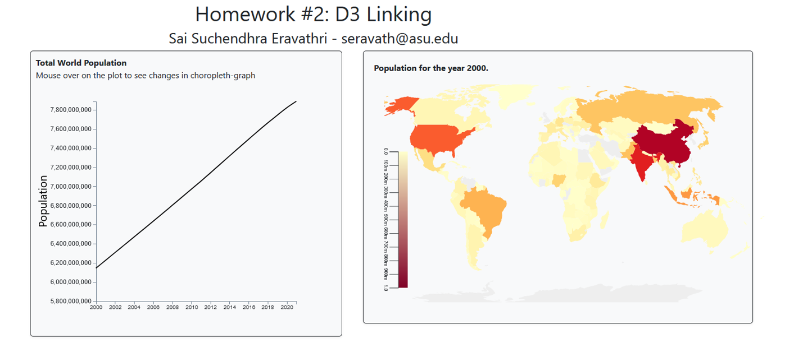

# Homework #2: Linking Charts and Adding Interactivity

The purpose of this homework is to give you practice interactively building and linking visualizations together in D3. By the end of this assignment you should be able to:

- Dynamically process the data by creating the required object.
- Visualize the values in Density and Choropleth Map Plots.
- Dynamically update a chart based on user interactions.
- Add an interactive tooltip.

The screenshot below shows an example of what your finished interface will look like.

## Overview

The provided initial code for this task includes two panels displayed on the index.html webpage. The first panel, located on the left-hand side, is intended to exhibit a density plot demonstrating the total population of the world between the years 2000 and 2021. When the mouse is hovered over this panel, the second panel on the right-hand side should change accordingly, displaying a choropleth map. This map will be updated with the population data for the year corresponding to the location of the mouse on the density plot.

## Data Description

The provided data for this assignment is the world population census for past 20 years. The total world population dataset is also provided you can use this dataset directly for density plot or you can get this from the actual data file by doing some group by operations. The dataset is static file with 3 attributes, Country, Year and Population. Coutry is categorical, Year is Quantitative, sequential and Population is Quantitative and Numerical. The coordinates for the choropleth map can be get from the below provided path.

geojson data for world map : https://raw.githubusercontent.com/holtzy/D3-graph-gallery/master/DATA/world.geojson

## To complete the assignment

- Clone this code template to your local machine.
- Start a local server and open the `index.html` page.
- Modify the given code according to the instructions below to achieve the requested interface.
- Commit and push the code back to this repository to submit it.

## Step 0: Starting code

When you first run the page, you should see the empty interface. Add your name and email to the top. It's up to you if you want to write your JavaScript code in a separate JS file, or in the main `index.html` file.

## Step 1: Displaying a Density chart

When you run the Index.html file initially you should show the density plot for the world population.

- Give the line in this chart a 2 pixel black border (i.e., stroke-width: 2px).
- When the user mouses over on the density plot these actions should be done: (1) First, emphasize the currently hovered location by showing the world population during that year. (2) Second, in the Right panel choropleth map should update with the slider on the density plot by taking the year.

## Step 2: Displaying a choropleth map

When the user correctly mouse over on the density plot the choropleth map should be updated with the population in each region during the selected year on the density plot.

## Step 3: Add a hover tooltip to the choropleth map

Finally, let's add a tooltip to the choropleth map. When the user hovers over a region on the map, we'll display the coutry name and the population during that year.

The tooltip should show the current letter that's being hovered and its count, styled like the above gif (e.g., white background, black rounded border with a width of 2 pixels). The tooltip should follow the user's mouse as it moves along the map, and disappear when it's no longer over the bar. You'll want to use mouse events to control this functionality (`mouseover`, `mousemove`, `mouseout`). 

## Grading

This assignment is worth 10 points.

- Step 0 is worth 1 point
- Step 1 is worth 3 points
- Step 2 is worth 3 points
- Step 3 is worth 3 points

This assignment has the opportunity for 1 extra credit point, as follows: In the bar choropleth Map, there is a `#character-name` span that is set to NONE. What do you think this label should say, and when should it be updated? Modify the code so that this label updates based on the user loading the choropleth Map (or hovering on map) in a way that makes sense, in the overall context of the user interface / user experience. (How you specifically modify it is up to you. If you want, you can also modify the "Population for the year:" part of the label as well.)

